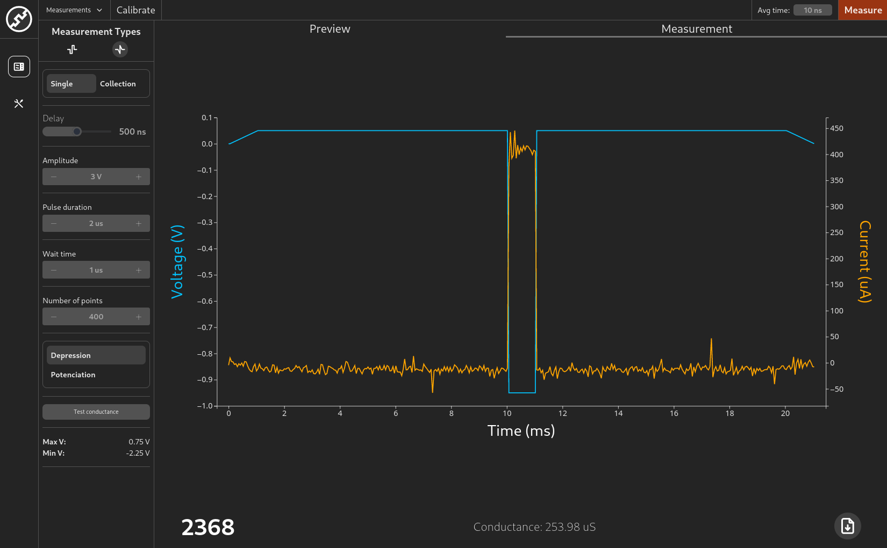

	
	<h2 align="center">Xavier</h2>
	
Keysight B1530A WGFMU measuring program

---

---

## Documentation

As of now there is no documentation available.

## Usage

Build the backend (`backend` folder) with `cargo build` and the frontend (`frontend` folder) using `yarn build`, copy the built `dist` folder from the frontend to the same directory as the backend, and run the backend.

## License

[GNU GPLv3](https://www.gnu.org/licenses/gpl-3.0.md).

## Copyright

Xavier © [Granasat](https://granasat.ugr.es).

---
